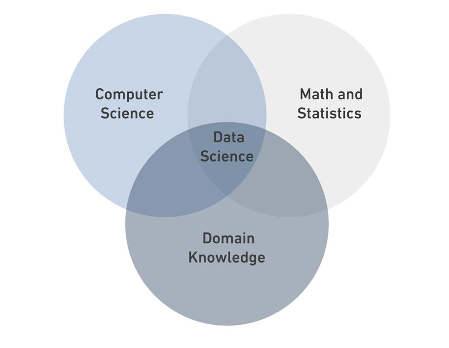

# Data Science
## What is Data Science?
**Data Science** is a *multidisciplinary* fild that combines statistics, computer science
, and domain knowledge.

### Data Types
* Strctured Data
* semi-Strctured Data
* Unstrctured Data

| Strctured Data | semi-Strctured Data | Unstrctured Data |
|----------|----------|----------|
| it is data that has been organised into a strict schema | it is data that dose not confirm to schema but has some structure   | it is data that has no scheme  |
| e.g: tables  | e.g: xml   | e.g: photos   |

`print('DS Bootcamp')`

[Read More](https://en.wikipedia.org/wiki/Data_science)
